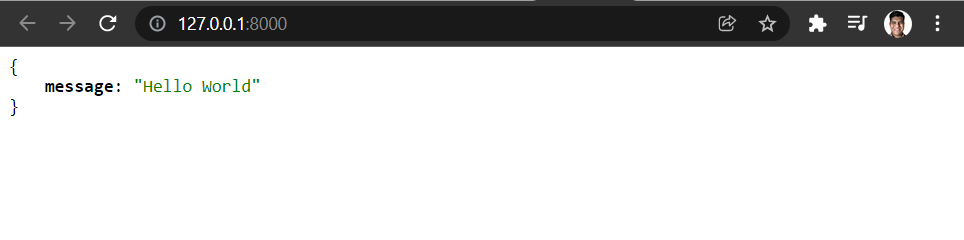

# Creación del código de mi primer API 💯

Lo primero es importar el FastAPI, es una clase que viene del módulo fastapi.
Es esta clase la que permite que todo el framework funcione.

```
from fastapi import FastAPI
```

Se crea una variable llamada app, esta variable va a contener toda la aplicación y para poder iniciarlizarla bien se le coloca una instancia de FastAPI -> le colocamos los paréntesis

```
app = FastAPI()
```

Se crea un **path operation decorator** usando la funcion get que viene del objeto app, que proviene de la instancia FastAPI

```
@app.get("/")
def home():
    return {"message": "Hello World"}
```

## ¿Cómo inicializar nuestra aplicación usando FastAPI? 💪

```
# Desde la terminal ejecutamos el comando

uvicorn main:app --reload
```

```
#uvicorn -> para inicalizar el servidor

#main -> Nombre del archivo donde tenemos el código
#app -> La variables que contiene una instacia de FastAPI

#--reload -> Modificador -> efecto hold reloading autoguardado habilitado con este flag
```

## Output de consola al ejecutar nuestro proyecto

```
C:\Users\Amaya\code\code-2022\Python\FastAPI-Fundamentals-Path-Operations-and-Validations (main -> origin)
(venv) λ uvicorn main:app --reload
INFO:     Will watch for changes in these directories: ['C:\\Users\\Amaya\\code\\code-2022\\Python\\FastAPI-Fundamentals-Path-Operations-and-Validations']
INFO:     Uvicorn running on http://127.0.0.1:8000 (Press CTRL+C to quit)
INFO:     Started reloader process [23120] using statreload
WARNING:  The --reload flag should not be used in production on Windows.
```

## Codigo completo 🐍

```
from fastapi import FastAPI

app = FastAPI()

@app.get("/")
def home():
    return {"message": "Hello World"}

```

## Respuesta del nuestro servidor con FastAPI :white_check_mark:

<p align="center"><p/>
